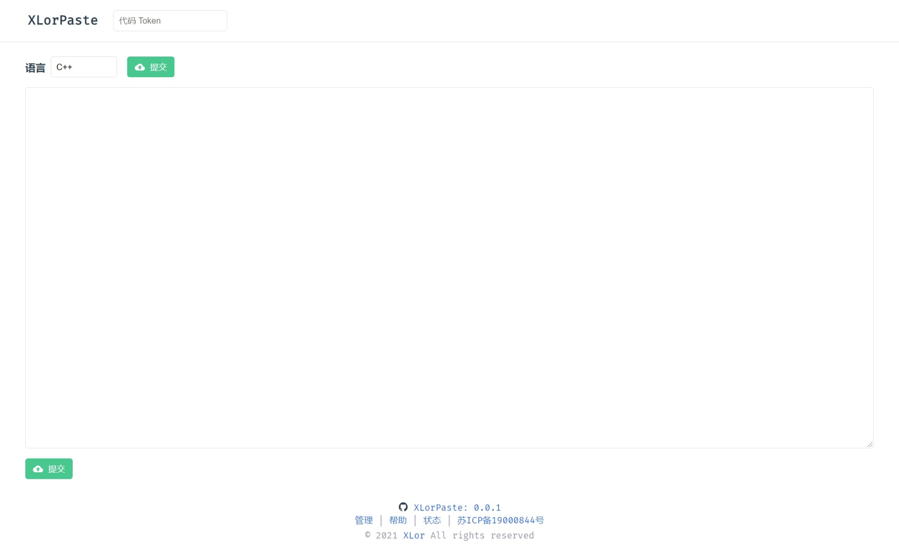
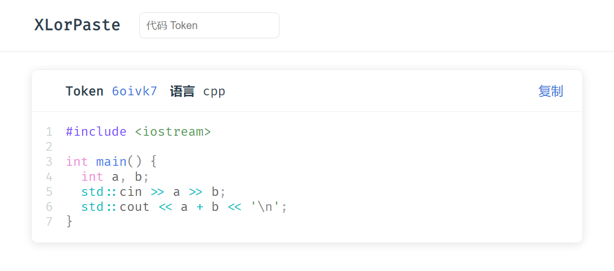
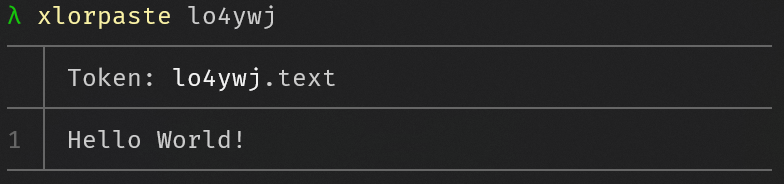

# XLorPaste Next Generation

[](https://github.com/XLorPaste/XLorPaste/actions/workflows/build.yml) [](https://github.com/XLorPaste/XLorPaste/actions/workflows/worker.yml)





## Local usage

Install cli.

```bash
npm i -g xlorpaste
pnpm i -g xlorpaste
yarn global add xlorpaste
```

Upload code.

```bash
echo "Hello World!" > a.txt
xlorpaste up a.txt
# Link  https://xlorpaste.cn/view/lo4ywj
# Token lo4ywj
```

View code.

```bash
xlorpaste lo4ywj
```



## License

MIT License © 2021 [XLor](https://github.com/yjl9903)
