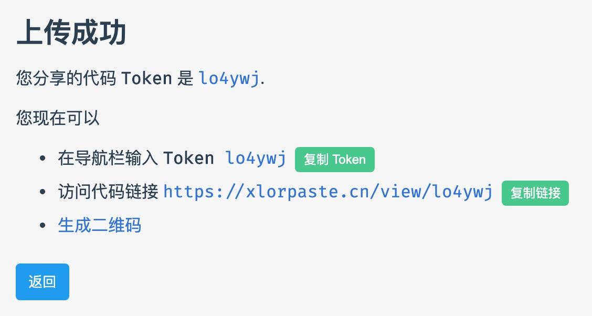

# XLorPaste

## 使用指南

### 分享代码

1. 选择你的想要分享的代码高亮语言，目前支持无高亮纯文本，`C++` `Python` `Java` `JavaScript` 等语言的代码高亮和 `JSON` 的解析；

2. 在文本框内输入你的代码；

3. 提交，成功后右上角会提示下图消息：

    + **Token**：每一份代码的唯一标识符，用于找到你分享的代码，请妥善保管！(找不到了可以再上传一份w)；

    + **查看文本**：跳转到你刚刚分享的代码查阅链接；

    + **复制链接**：复制你的代码查阅链接。
  

### 阅览代码

+ 你拥有代码的分享链接：直接打开就行了。

+ 你拥有代码的 **Token**：在导航栏内的输入框中输入你的 **Token**，按回车跳转。
